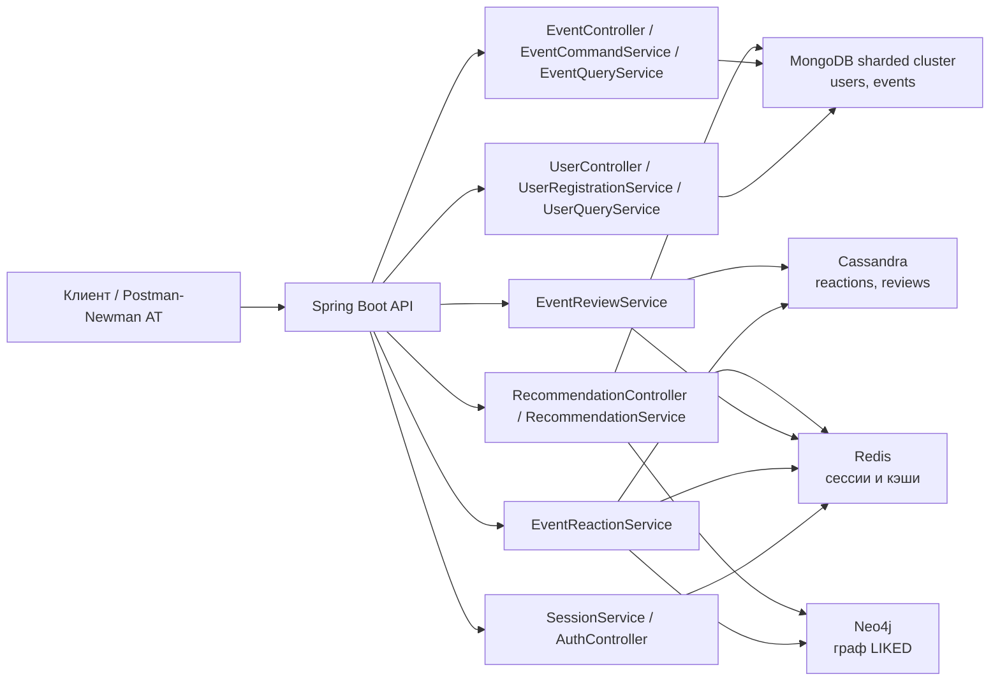
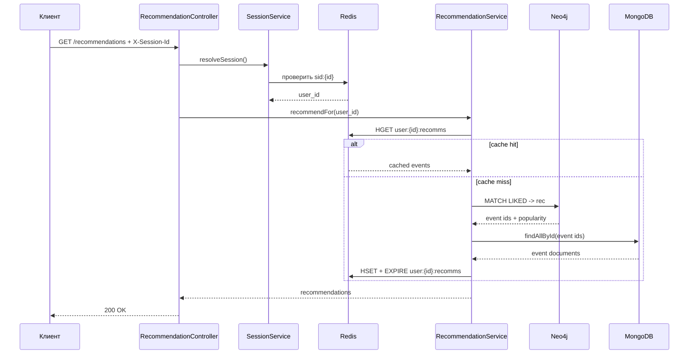

# EventHub

[](https://github.com/{your_username}/{your_repo}/actions/workflows/eventhub.yml)

Backend-сервис платформы мероприятий. Выполняется поэтапно в рамках 7 лабораторных работ курса по NoSQL базам данных.

**Стек:** Redis · MongoDB (sharded) · Cassandra · Neo4j · Spring Boot (Kotlin)

## Запуск

```bash
make run   # docker compose --env-file .env.local up -d --build
make stop  # docker compose down
```

После запуска сервис доступен на `http://localhost:8080` (порт задаётся в `.env.local`).

## Архитектура

Сервис реализован как REST API на Spring Boot, а каждая лабораторная добавляет отдельный слой хранения или кэширования.

### Схема компонентов



### UML-схема запроса рекомендаций



## Тестирование

Проект проверяется автоматическим пайплайном курса и локальными API-автотестами (АТ).

- CI: GitHub Actions запускает autograder из `sitnikovik/ndbx`, номер лабораторной берётся из `.labrc` (`LAB=7`).
- Локально: API-АТ описаны Postman-коллекциями из [`api/`](api/) и общим окружением `environment.postman_environment.json`.
- Через UI: поднять стенд через `make run`, импортировать коллекции и environment **EventHub Local**, затем запускать коллекции через Postman Collection Runner.
- Через CLI: при установленном `newman` можно прогнать одну коллекцию с подготовленным environment командой `newman run api/lab07.postman_collection.json -e api/environment.postman_environment.json`.
- Сквозной CLI-прогон: коллекции `lab01`-`lab07` запускаются по порядку, а environment экспортируется после каждой коллекции, чтобы сохранялись `session_id`, `user_id`, `event_id` и `review_id`.

```bash
make run
cp api/environment.postman_environment.json /tmp/eventhub.postman_environment.json
for collection in api/lab0*.postman_collection.json; do
  newman run "$collection" \
    -e /tmp/eventhub.postman_environment.json \
    --export-environment /tmp/eventhub.postman_environment.json
done
```

Покрытие АТ: healthcheck, анонимные сессии, регистрация и логин, создание, просмотр, обновление и поиск мероприятий, реакции, отзывы и рекомендации.

## API

Коллекции Postman для каждой лабораторной находятся в [`api/`](api/).

| Файл | Лабораторная |
|------|-------------|
| `lab01.postman_collection.json` | Lab 01 — Healthcheck |
| `lab02.postman_collection.json` | Lab 02 — Redis: Sessions |
| `lab03.postman_collection.json` | Lab 03 — MongoDB: Users & Events |
| `lab04.postman_collection.json` | Lab 04 — MongoDB: Sharding |
| `lab05.postman_collection.json` | Lab 05 — Cassandra: Reactions |
| `lab06.postman_collection.json` | Lab 06 — Cassandra: Reviews |
| `lab07.postman_collection.json` | Lab 07 — Neo4j: Recommendations |

**Импорт:** Postman → Import → выбрать все файлы из `api/` → выбрать environment **EventHub Local**.

### Эндпоинты

| Method | Path | Auth | Описание |
|--------|------|------|----------|
| `GET` | `/health` | — | Healthcheck |
| `POST` | `/session` | — | Создать / обновить анонимную сессию |
| `POST` | `/users` | — | Регистрация |
| `POST` | `/auth/login` | session | Вход |
| `POST` | `/auth/logout` | session | Выход |
| `GET` | `/users` | — | Поиск организаторов (`name`, `id`, `limit`, `offset`) |
| `GET` | `/users/{id}` | — | Карточка организатора |
| `GET` | `/users/{id}/events` | — | Мероприятия организатора |
| `POST` | `/events` | auth | Создать мероприятие |
| `GET` | `/events` | — | Список / поиск мероприятий |
| `GET` | `/events/{id}` | — | Карточка мероприятия |
| `PATCH` | `/events/{id}` | organizer | Изменить `category`, `price`, `city` |
| `POST` | `/events/{id}/like` | auth | Лайк |
| `POST` | `/events/{id}/dislike` | auth | Дизлайк |
| `POST` | `/events/{id}/reviews` | auth | Оставить отзыв |
| `GET` | `/events/{id}/reviews` | — | Список отзывов (`limit`, `offset`) |
| `PATCH` | `/events/{id}/reviews/{rid}` | author | Изменить отзыв |
| `GET` | `/recommendations` | auth | Рекомендации (Neo4j + Redis cache) |

`GET /events` и `GET /events/{id}` принимают `?include=reactions`, `?include=reviews` или `?include=reactions,reviews`.

## Лабораторные работы

| # | Тема | Хранилище |
|---|------|-----------|
| 1 | Healthcheck | — |
| 2 | Анонимные сессии | Redis |
| 3 | Пользователи и мероприятия | MongoDB |
| 4 | Шардирование и репликация | MongoDB |
| 5 | Реакции | Cassandra + Redis |
| 6 | Отзывы | Cassandra + Redis |
| 7 | Рекомендации | Neo4j + Redis |

Задания: [github.com/sitnikovik/ndbx/docs/lab](https://github.com/sitnikovik/ndbx/tree/main/docs/lab)
